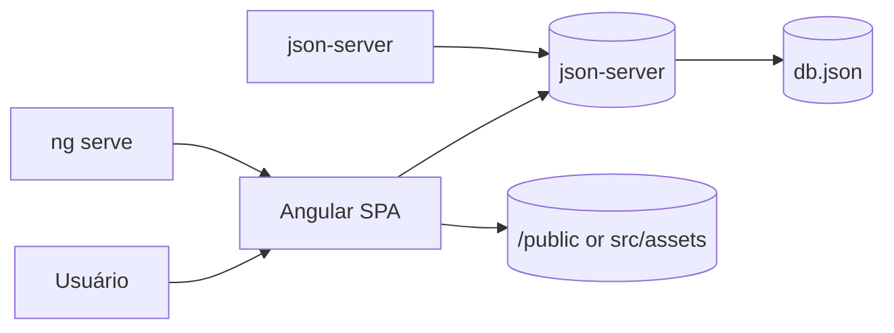

# Memoteca

Um aplicativo simples criado com Angular que demonstra CRUD de "pensamentos" usando um backend leve (JSON-server) para armazenamento local.

**Visão Geral**
- **Descrição:**: Aplicação SPA em Angular para criar, editar, listar e excluir pensamentos (anotações curtas).
- **Objetivo:**: Exemplo didático de arquitetura frontend + backend mock (JSON) com foco em boas práticas de organização e fácil execução local.

**Funcionalidades**
- **Listar:**: Exibe pensamentos salvos.
- **Criar/Editar/Excluir:**: Operações CRUD básicas.
- **Frontend:**: Implementado em Angular (pasta `src/`).
- **Backend:**: API simulada com `json-server` usando `backend/db.json`.

**Arquitetura**
- **Visão de alto nível:**: Browser (SPA Angular) ⇄ API REST (json-server) ⇄ `db.json` (persistência simples). Assets estáticos servidos pelo frontend.

Observação: se o preview automático do Mermaid não aparecer na sua IDE, visualize neste arquivo no GitHub ou use uma extensão de preview Mermaid no VS Code (ex.: "Markdown Preview Mermaid Support").

**Requisitos**
- **Node.js:**: versão LTS (recomendado).
- **npm / pnpm / yarn:**: gerenciador de pacotes.
- **Angular CLI (opcional):**: para executar `ng serve` localmente.

**Instalação & Execução (desenvolvimento)**
- **Frontend:**
  - Instale dependências: `npm install` (executar na raiz do projeto).
  - Inicie o frontend: `ng serve` ou `npm run start`.
  - Abra: `http://localhost:4200/`.
- **Backend (API mock):**
  - Entre na pasta do backend: `cd backend`.
  - Instale dependências: `npm install`.
  - Inicie o json-server: `npm run start` (ou `npx json-server --watch db.json --port 3000`).
  - A API ficará disponível em: `http://localhost:3000/` (verifique `backend/package.json` para porta/rota exata).

**Testes**
- **Frontend:**: Execute `ng test` ou `npm run test` para rodar os testes unitários (Karma/Jasmine).
- **Backend:**: Não há testes automatizados por padrão (json-server).

**Build & Deploy**
- **Build de produção:**: `ng build --configuration production`.
- **Artefatos:**: Os arquivos compilados ficam em `dist/`.
- **Hospedagem:**: Pode ser hospedado em qualquer servidor estático (Netlify, Vercel, GitHub Pages) com o backend apontando para uma API real ou um mock persistente.

**Contribuição**
- **Como contribuir:**: Abra uma issue para discutir mudanças e envie PRs com mudanças claras e atômicas.
- **Padrões:**: Mantenha código limpo, commits pequenos e testes quando aplicável.

**Visualizar o diagrama Mermaid localmente**
- **VS Code:**: Instale uma extensão de preview (ex.: "Markdown Preview Mermaid Support" ou "Mermaid Markdown Preview").
- **Linha de comando:**: Instale `mmdc` (Mermaid CLI) via `npm i -g @mermaid-js/mermaid-cli` para gerar imagens a partir do código Mermaid.

**Contatos & Licença**
- **Autor:**: `darpbr` (repositório local).
- **Licença:**: Verifique a licença do repositório (adicionar `LICENSE` se necessário).

